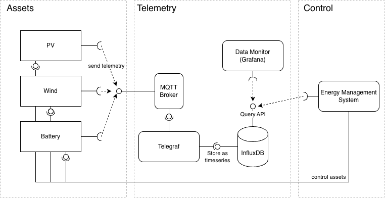

# Welcome
This is a toy project to learn about technology and practice software developement and DevOps.

# Poor Man's Micro Grid

The Poor Man's Micro Grid is a bunch of software and infrastructure as code components to simulate assets and management software for a small power grid. It operate of assert management level. There is no need for percise physic simulation and the choosen interfaces and protocols are close to industrial standards but sometimes abstract in sake of learning. Even if there is a lot of simulation, the system is ment to focus on real time control of a smart grid.

# Components

## Assets
Small independend software components which simulat an asset which produce or consume power in the grid. It sends telemetry data and have a interface to receive control commands to increase or decrease suppy/drain or, in case of a battery, switch modes.

### Asset Types

- PV
- Wind
- Load
- BESS

## Telemetry
Telemetry components are responsible for collect, store and display telemetry data send by assets. There are stored as timeseries.

## Control
The control plain read telemetry data of the grid to
- evaluate the state of the grid
- make decisions 
- send/write control commands

The goal ist to implement a simple Energy Management System (EMS) to act on telemetry data and take decisions to stable the grid